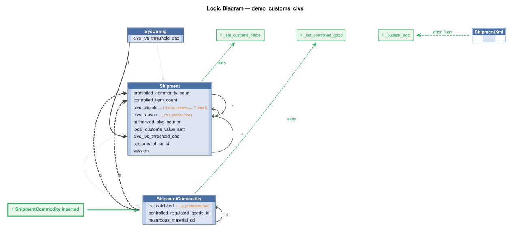

# Logic Flow — demo_customs_clvs

<table>
<tr valign="top">
<td width="65%">



</td>
<td width="35%">

### Rules

1. `clvs_lvs_threshold_cad = copy(clvs_lvs_threshold_cad)`<br>
2. `clvs_eligible = 1 if clvs_reason == "" else 0`<br>
3. `is_prohibited = _is_prohibited(row)` — Derive is_prohibited: 1 if the commodity line carries a hazardous material code, else 0.<br>
4. `clvs_reason = _clvs_reason(row)` — Derive clvs_reason: comma-delimited list of CLVS ineligibility reasons (blank if eligible).<br>
5. `prohibited_commodity_count = count(ShipmentCommodity where is_prohibited)`<br>
6. `controlled_item_count = count(ShipmentCommodity where controlled_regulated_goods_id)`<br>
E. `Shipment` → `_set_customs_office` (early) — Shipment event: looks up CustomsOffice by planned_clearance_location_cd == office_code<br>
E. `ShipmentCommodity` → `_set_controlled_good` (early) — ShipmentCommodity event: looks up ControlledRegulatedGood by the harmonized_tariff_nbr<br>
E. `ShipmentXml` → `_publish_isdc` (after_flush) — ShipmentXml event: publishes the raw payload to Kafka topic isdc_processed so

</td>
</tr>
</table>

## Requirements

```
Scenario: Shipment at or below the LVS threshold is eligible
  Given a shipment imported by an authorized CLVS courier
  And the shipment has an estimated value for duty not exceeding CAD $3,300
  And the shipment has no prohibited commodity lines (ShipmentCommodity.is_prohibited = 1)
  And the shipment has no controlled or regulatory goods (lookup using first ten digits of the harmonized tariff number)
  And the shipment is released at a CBSA-designated customs office
  When the shipment eligibility is evaluated
  Then the shipment shall be eligible for the CLVS Program
  And set the clvs_reason as a comma delimited list of short all reasons why failed (or blank)
```

```
EAI Consume — isdc topic, row-event bridge.

On ShipmentXml insert (Tx 1, from Consumer 1 or /consume_debug), publish the raw
payload to isdc_processed so Consumer 2 can parse and persist domain rows in Tx 2.
See integration/kafka/kafka_subscribe_discovery/isdc.py for the full pipeline.
```

```
Logic discovery: Shipment matching (Phase 2).

Create `logic/logic_discovery/shipment_matching.py`.

On Shipment insert, look up the matching Customer using:
    Shipment.trprt_bill_to_acct_nbr == Customer.duty_bill_to_acct_nbr

If no match: log a warning, do nothing.
If match found: create a ShipmentParty row, matching high confidence columns
from Customer to ShipmentParty.
Use Rule.row_event (not early_row_event) — fires before_flush so the new
ShipmentParty writes atomically with the parent Shipment.
```

---
_Generated 2026-08-11 18:36_
